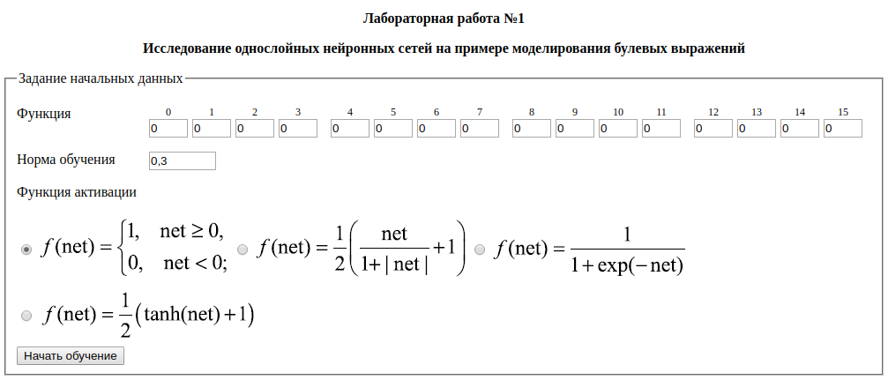

# Лабораторная работа №1
## Исследование однослойных нейронных сетей на примере моделирования булевых выражений
### Запуск программы
```sh
git clone https://github.com/moguchev/neural-network.git
cd neueral-network/Lab01
```
Откройте в браузере *lab01.html*

